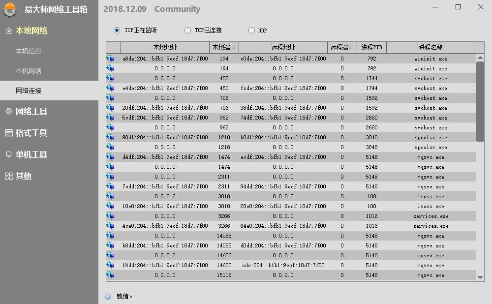

# NetToolbox

中文 | [English](README-en.md)

易大师网络工具箱

## 描述

易大师网络工具箱是一个开源小工具集合，集成了网络方面众多小功能，可以极大提高您的工作效率

源码结构讲解：[【易大师网络工具箱】项目解析](https://www.fawdlstty.com/archives/608.html)

所用界面库（MIT开源）：[DuiLib_Faw](https://github.com/fawdlstty/DuiLib_Faw)

> 本地网络

1. 本机信息：展示本机各类系统信息，包括配置信息与CPU ID、主板ID等信息
2. 本机网络：展示本机当前所有网络信息
3. 网络连接：展示本机当前有哪些进程访问网络，列出连接端口地址，右键菜单打开进程位置或结束进程

> 网络工具

1. 路由跟踪：跟踪从当前主机到目标地址所经过的链接数
2. HTTP请求：模拟实现HTTP(s)的GET/POST请求
3. QPS测试：测试指定Web服务所能承受的最大HTTP连接数

> 格式工具

1. 正则表达式：用于测试验证正则表达式执行效果
2. RSA生成：用于生成RSA公私钥对
3. 转码解码：支持4种方式的转码及解码操作

> 单机工具

1. GIF录制：用于录制GIF图片
2. 串口调试工具：用于调试串口
3. 窗口工具：用于屏幕取色、窗口信息获取
4. 文件工具：用于计算文件哈希值
5. 步骤记录器：打开Windows自带的步骤记录器

## 编译步骤

1. 安装VS2017、vcpkg、7-zip与upx并设置环境变量，直到这几个命令能在命令行里直接使用
2. 执行命令：vcpkg install boost:x86-windows boost:x86-windows-static openssl:x86-windows openssl:x86-windows-static nlohmann-json:x86-windows nlohmann-json:x86-windows-static curl:x86-windows curl:x86-windows-static
3. 编译

## 修改日志

2019.03.29 Community 替换DuiLib_Faw实现

2018.12.18 Community 修复Combo控件显示不正常的bug；修复分析文件时偶发性崩溃

2018.12.09 Community 开源；修改描述信息

2018.11.29 Community 优化在启动时阻塞请求网络的问题；优化网页首页展示；新增Base64编码解码；完成http、qps两个页面的参数编辑优化

2018.11.26 Community 修复更新失败的问题；新增部分常用正则；修复升级正则所造成的路由跟踪bug

2018.11.24 Community 修复保存图片的bug；主机信息页面新增硬件信息展示；列表页优化；修复win7下崩溃的bug；修复本地连接为空时切换标签页无效的bug；修复存储图片无效的bug；优化文件存储失败提示

2018.11.21 Community 重构界面文件；新增取色指示框；文件覆盖提示；进程提权提示

2018.11.14 beta 修复网络连接列表在切换类型的地方没有及时更新的bug；主页内存数据实时更新

2018.11.14 alpha 本地连接列表更新优化；完成右键菜单的结束进程、打开文件所在位置功能

2018.11.13 alpha 修复颜色萃取器的位置缩放bug；网络连接拆开三种不同的连接方式；修复更新没有验证md5的bug

2018.11.12 alpha 涉及缩放功能的bug的修复；gif录屏窗口保持最前；新增颜色萃取选择框

2018.11.11 alpha 新增转码解码功能

2018.11.08 beta 优化gif录屏框的显示；修复路由跟踪时显示bug

2018.11.06 alpha gif录像完成鼠标绘制

2018.11.05 beta 修复列表bug；修复更新bug；优化服务器运行统计

2018.11.04 beta 修复gif窗口显示bug

2018.11.04 alpha 修复路由跟踪时可多次点击的bug；新增屏幕gif录制功能

2018.11.03 alpha 修复http下post提交没有指定data的bug

2018.11.02 beta 修复RichEdit无法复制bug;网络连接新增排序功能；关于页优化

## 许可证

第三方库 DuiLib_Faw 与 serial 按原项目许可协议进行许可

其他未明确标注的均为 GPL-3.0 许可协议进行许可

## 赞助

## 其他

技术交流：[点击链接加入群【网络工具箱交流群 943497747】](https://jq.qq.com/?_wv=1027&k=5vG1SGq)
