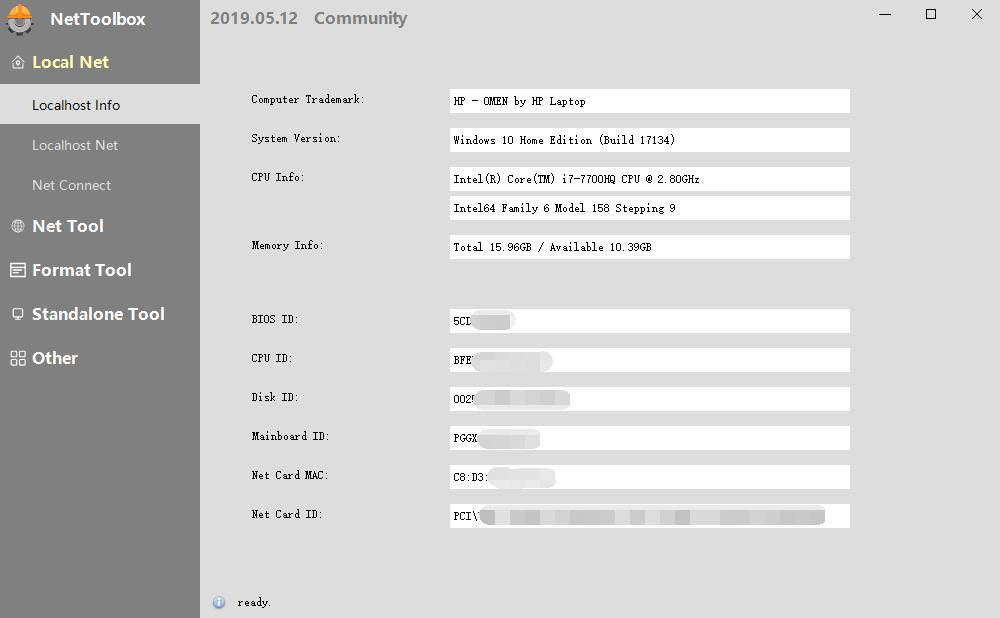

# NetToolbox

English | [简体中文](README-cn.md)

Net Toolbox for Master Yi

## Description

NetToolbox is a opensource mini tool collection, it's contains some tool for network, it's may improve your productivity.

Source structure explanation: [【易大师网络工具箱】项目解析](https://www.fawdlstty.com/archives/608.html)

UI Library（MIT License）: [DuiLib_Faw](https://github.com/fawdlstty/DuiLib_Faw)

> Local Net

1. Localhost Info: Display various system information of the machine, including configuration information, CPU ID, motherboard ID and other information
2. Localhost Net: Displays all network information on the machine
3. Net Connect: Shows which processes are currently accessing the network on the machine, lists the port address of the connection, right click to open the process location or end the process

> Net Tool

1. Tracert: Keeps track of the number of links from the current host to the destination address
2. HTTP Request: Simulate GET/POST requests that implement HTTP(s)
3. QPS Test: Test specifies the maximum number of HTTP connections the Web service can withstand

> Format Tool

1. Regex Tool: Used to test and validate regular expression execution
2. RSA Generate: Used to generate RSA public-private key pairs
3. Encode Decode: Supports 4 modes of transcoding and decoding operations

> Standalone Tool

1. GIF Record: Used to record GIF images
2. Serial Port: Used for debugging serial ports
3. Window Tool: Used for screen color, window information acquisition
4. File Tool: Used to calculate the file hash value

## Compile Steps

1. Install VS2017/vcpkg/7-zip/upx and set environment variables, Until these commands can be used directly from the command line
2. run: vcpkg install boost:x86-windows-static openssl:x86-windows-static nlohmann-json:x86-windows-static curl:x86-windows-static fmt:x86-windows-static asio:x86-windows-static
3. compile

## License

GPL-2.0

## Other

技术交流：[点击链接加入群【1018390466】](https://jq.qq.com/?_wv=1027&k=7ZQLihbT)
